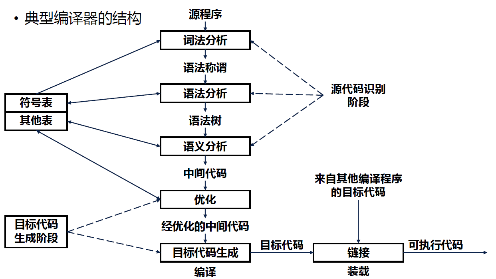

# 编译技术

### 课程内容

编译器构造的一般原理和基本实现方法

理论知识：形式语言和自动机理论、语法制导的定义和属性文法、类型论等。

## 第一章：概述

### 什么是程序设计语言

定义：词汇量少、语法简单、意义明确的语言

分类：强制式语言，应用式语言，基于规则的语言，面向对象语言

发展：第一代语言：机器语言，第二代语言：汇编语言，第三代语言：高级语言，第四代语言，新一代语言

### 程序设计语言的处理系统

编译型：采用编译方法的语言处理系统。

解释型：采用解释方法的语言处理系统。

混合型：兼有编译和解释两种方法的语言处理系统。

源程序：语言处理系统的输入程序。

源语言：编写输入程序的语言。

目标程序：输出的程序

目标语言：相应的语言

把高级语言的源程序变换为语义等价的某种目标语言程序的程序称为编译程序或编译器。这种变换过程就称为编译（Compile）或翻译（Translate）。

### 编译程序和解释程序

编译程序生成的机器代码不能直接在目标机上运行，它需要有运行时库程序（Runtime Library Routine，简称运行程序）伴随，才能正确运行。

通常做法是，将源程序转换成一种比较容易执行的中间代码（这种中间代码与机器代码不同），中间代码的解释由软件支持，因为硬件解释器在这里不能直接使用。

通常称这种支持解释的软件为解释程序或解释器（Interpreter）。编译器是解释器的一种，特指目标语言比源语言低级

编译程序的作用：把源语言变换为目标语言。



通常将分析部分划分为词法分析、语法分析和语义分析三个阶段

词法分析：编译器将源程序看成一个很长的字符串，首先对它进行从左到右的扫描，并进行分析，识别出符合词法规则的单词（符号），或称记号（Token）。

语法分析：语法分析是对词法分析识别出来的符号流（也可看成符号串）。按语法规则进行分析，识别出各类语法单位，如表达式、短语、子句、句子和程序等，以便后续步骤进行分析与合成语法分析通常是一种结构分析，分析的结果形成一棵语法树（分析树）。

语义分析：对经过词法分析和语法分析后的程序，如果没有错误，就可对其进行语义分析，并可按语义要求对各种语法单位进行实质性翻译大多数编译器采用中间语言来描述源程序的语义。

优化：语义分析产生的中间代码不依赖于任何实际机器，因此它易于实现一些等效变换，使生成的目标程序占用空间少，执行更快，从而使目标程序优化（Optimization）。

目标代码生成：根据优化后的中间代码及有关信息，可生成较为有效的目标代码，即目标机的机器语言程序或汇编语言程序。

## 第二章：词法分析

#### 词法分析器的任务

把构成源程序的字符流翻译成词法记号流

### 2.1 词法记号及属性

#### 词法分析的主要任务

扫描输⼊字符流，产⽣⽤于语法分析的词法记号序列

#### 词法分析器能完成的任务

1. 剥去源程序的注解和有空格、制表或换⾏符等引起的空⽩
2. 把来⾃编译器各个阶段的错误信息和源程序联系起来
3. 预处理宏定义
   **词法记号定义**
   由记号名和属性值（不必要）构成的⼆元组，记号名是代表⼀类词法单元的抽象名字。
   **模式（规则）定义**
   描述属于该记号的词法单元的形式。在⼀个关键字作为⼀个记号的情况下，它的模式是构成该关键字的字符序列。
   **词法单元定义**
   是源程序中匹配⼀个记号模式的字符序列，它由词法分析器标识为该记号的实例。
   **标准标识符**
   预先确定了含义的标识符，但程序可以重新声明它的含义。在该声明的作⽤域内，程序声明的含义起作⽤，⽽预先
   确定的含义⼩时，在其他地⽅则都是预先确定的含义起作⽤。
   **词法记号的属性**
   记号名影响语法分析的决策，属性影响记号的翻译。

#### 词法错误

| 发现错误                                                                 | 错误恢复                                                                                                                     |
| ------------------------------------------------------------------------ | ---------------------------------------------------------------------------------------------------------------------------- |
| ⼏乎发现不了源程序的错误，因为词法分析器对<br />源程序采取⾮常局部的观点 | 紧急恢复（最简单的）：删掉输⼊指针当前指向的若<br />⼲个字符（剩余输⼊的前缀），直到词法分析器<br />能发现⼀个正确的记号为⽌ |
|                                                                          | 错误修补尝试：删除⼀个多余的字符、插⼊⼀<br />个遗漏的字符、⽤⼀个正确的字符代替<br />⼀个不正确的字符、交换两个相邻的字符   |

### 2.2 词法记号的描述与识别

#### 正规式

正规式是表示模式的规则的⼀种重要⽅法。

#### 字⺟表、串、⻓度、语⾔

| 概念     | 描述                                                       |
| -------- | ---------------------------------------------------------- |
| 字⺟表   | 表示符号的有限集合                                         |
| 串       | 某⼀字⺟表符号的有穷序列                                   |
| 串的⻓度 | 出现在该串中符号的个数                                     |
| 语⾔     | 表示字⺟表上的⼀个串集，属于该语⾔的串称为该语⾔的句⼦或字 |

#### 语⾔运算

| 运算   | 描述                           | 符号       |
| ------ | ------------------------------ | ---------- |
| 和     | 两个集合的并集                 | ∪         |
| 连接   | 两个集合的笛卡尔积  ⽆符号连接 | ⽆符号连接 |
| 闭包   | 表示另个或多个集合连接的并集   | *          |
| 正闭包 | 表示⼀个或多个集合连接的并集   | +          |

#### 正规式的定义

按照⼀组定义规则，由较简单地正规式构成的，每个正规式表示⼀个语⾔L(r)。这些定义规则说明L(r)是怎样从r的
⼦正规式所表示的语⾔中构造出来的。

#### 正规集的定义

正规式表示的语⾔叫做正规集。

#### 正规集的运算约定

| 运算 | 优先级 | 结合性 |
| ---- | ------ | ------ |
| *    | 最高   | 左结合 |
| 连接 | 次之   | 左结合 |
| I    | 再次之 | 左结合 |

#### 正规式的代数定律

| 概念                                     | 描述                   |
| ---------------------------------------- | ---------------------- |
| r I s = s I r                            | I 可交换               |
| r I (s I t) = (r I s) I t                | I 可结合               |
| (rs)t =  r(st)                          | 连接 可结合            |
| r (s I t) = rs I rt；(s I t) r = sr I tr | 连接对 I 可分配        |
| εr = r；rε = r                         | ε 连接恒等元素        |
| r* = (r I ε)*                           | ε肯定出现在⼀个闭包中 |

#### C语言正规定义

`letter_->A|B|...|Z|a|b|c|...|z|_ digit->0|1|...|9 id->letter_(letter_|digit)*`

#### 无符号数正规定义

⽆符号数是由整数部分、⼩数部分、指数部分三部分组成，其中⼩数部分和指数部分都是可能出现或可能不出现
的。指数部分如果出现，是E及可能有的+或-号，再跟上⼀个或多个数字。⼩数点后必然有⼀个数字。

`digit->0|1|...|9 digits->digit digit* optional_fraction->.digits|ε optional_exponent->(E(+|-|ε)digits)|ε number->digits optional_fraction optional_exponent`

#### 正规式缩写

| 缩写           | 符号  | 描述                        |
| -------------- | ----- | --------------------------- |
| ⼀个或多个实例 | +     | 和*拥有同样的结合性和优先级 |
| 零个或⼀个实例 | ?     | r I ε                      |
| 字符组         | [abc] | a I b I c                   |
| 字符组         | [a-z] | a I b I c I...I z           |

#### 状态转换图定义

状态转换图描绘语法分析器为得到下⼀个记号⽽调⽤词法分析器时，词法分析器所做的动作。

| 正规式 | 记号名 | 属性值                 |
| ------ | ------ | ---------------------- |
| ws     | ---    | ---                    |
| while  | while  | ---                    |
| do     | do     | ---                    |
| id     | id     | 符号表条⽬的指针       |
| number | number | 数表条⽬的指针         |
| relop  | relop  | LT、LE、EQ、NE、GT或GE |

#### 转换图属性

| 图形     | 描述         |
| -------- | ------------ |
| 圆圈     | 状态         |
| 箭头     | 边           |
| 标记     | 连接可结合   |
| 两个圆圈 | 接受状态     |
| *        | 输入指针回退 |

#### installID( )

1. 看关键字表
2. 如果当前词法单元构成关键字，则返回相应的记号，结束；否则跳到3
3. 该词法单元是标识符，看标识符表
4. 如果在标识符表发现发现该词法单元则返回相应的条⽬指针；否则该词法填⼊

#### installNum( )

把词法单元置⼊数表，并返回建⽴的条⽬的指针

### 2.3 有限自动机

#### 语言的识别器

它是一个程序，它取串x作为输入。当x是语言的句子时，它回答“是”，否则回答“不是”。可以通过构造称为有限自动机的更一般的转换图，把正规式翻译成识别器。

#### 有限自动机分类

| 类型           | 描述                                                 |
| -------------- | ---------------------------------------------------- |
| 不确定的 (NFA) | 存在这样的状态，对于某个输入符号，它存在不止一种转换 |
| 确定的 (DFA)   | 所有状态输入某个符号都只存在一种转换                 |

#### 不确定的有限自动机模型 (NFA)

| 内容           | 表示       |
| -------------- | ---------- |
| 有限的状态集合 | \( S \)    |
| 输入符号的集合 | \( \sum \) |
| 转换函数       | \( move \) |
| 唯一的开始状态 | \( s_0 \)  |
| 接收状态集合   | \( F \)    |

#### 转换表

每个状态一行，每个输入符号和（如果存在的话）各占一行，表的第i行中符号a的条目是一个状态集合（说的更实际一些，是状态集合的指针），这是NFA在输入是a时，状态i所能到达的状态集合。

| 优点                           | 缺点                                             |
| ------------------------------ | ------------------------------------------------ |
| 快速访问给定状态和字符的状态集 | 当输入字母表较大并且大多数转换是空集时，浪费空间 |

由NFA定义的语言是它接受的输入串集合。

#### 确定的有限自动机模型 (DFA)

是不确定有限自动机的特殊情况。确定的有限自动机从任何状态出发，对于任何输入符号，最多只有一个转换。

| 特殊内容                                                | 说明                                                       |
| ------------------------------------------------------- | ---------------------------------------------------------- |
| 任何状态都没有ε转换                                    | 任何状态都必须进行输入符号的匹配才能进入下一个状态         |
| 对任何状态s和任何输入符号a，最多只有一条标记为a的边离开 | 转换函数move：\( S \times \sum \to S \) 可以是一个部分函数 |

| 有限转换表                       | 有限转换图                                                     |
| -------------------------------- | -------------------------------------------------------------- |
| 表中的每个栏目最多只有一个状态。 | 从开始状态起，最多只有一条到达某个终态的路程可以由这个串标记。 |

#### 模拟DFA

```pseudocode
s = s0;
c = nextChar();
while (c != eof) {
    if (move(s, c) 未定义)
        return "no";
    else
        s = move(s, c);
    c = nextChar();
}
if (s 属于 F)
    return "yes";
else
    return "no";
```

#### 子集构造法定义

从NFA构造识别同样语言的DFA所用到的算法。

#### 子集构造法思想

在NFA的转换表中，每个条目是一个状态集；在DFA的转换表中，每个条目只有一个状态。如果让新构造的DFA的每个状态代表该NFA的一个状态集，这个DFA在输入 a1a2…an**a**1a**2****…**a**n **后到达的状态对应该NFA从开始状态沿着那些标有 a1a2…an**a**1****a**2…**a**n** 路径能到达的所有状态集合。

**算法：从NFA到DFA的子集构造法**

* 输入：一个NFA N
* 输出：一个接受同样语言的DFA D
* 方法：为D构造转换表Dtran，表中的每个状态是N的状态集合，D“并行”的模拟N面对输入串的所有可能的移动

#### DFA化简重要结论

重要结论：每一个正规集都可以由一个状态数最少的DFA识别，这个DFA是唯一的。

#### DFA化简基于转换函数是全函数

如果一个DFA的转换函数不是全函数，可以引入一个死状态 sd**s**d，sd**s**d 对所有输入符号都转换到 sd**s**d 本身。

#### 区别状态的方法

对于DFA M，如果从状态s出发，在面临输入w时，最终停在一个接收状态，而从状态t出发，面临w时，它停留在一个非接收状态，或者反过来，则串w可以用来区别状态s和t。

#### 极小化DFA状态数算法

把状态分成一些不相交的子集，每一子集的状态都是不可区别的，不同子集的状态都是可区别的，每个子集合并成一个状态。

**算法步骤：**

1. 划分包含两个子集：接受状态子集和非接受状态子集；
2. 检查每一个子集，看其中的状态是否还可区别。
3. 重复1、2过程，对当前划分进一步细分，直到没有任何一个子集再需细分为止。

使用这个算法时，其输入DFA的状态转换函数必须是全函数，否则有可能得到的新DFA和原来的接收不同的语言。所以我们引入死状态，其目的就是把转换函数变成全函数。

---

### 2.4 从正规式到有限自动机

#### 从正规式构造NFA的一个算法

该算法是语法制导的，它用正规式语法结构来指导构造过程。

1. 构造识别字母ε和字母表中的一个字符的自动机
2. 构造识别主算符为选择、连接或闭包的正规式的自动机

在构造过程中，每步最多引入两个新的状态。
